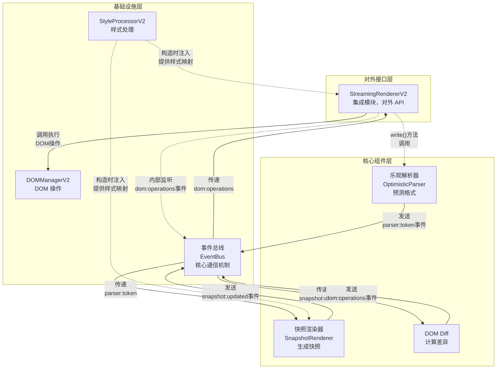
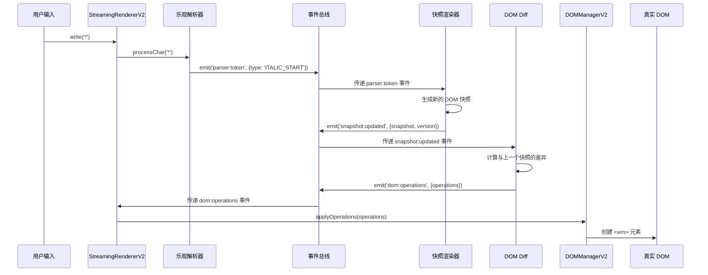
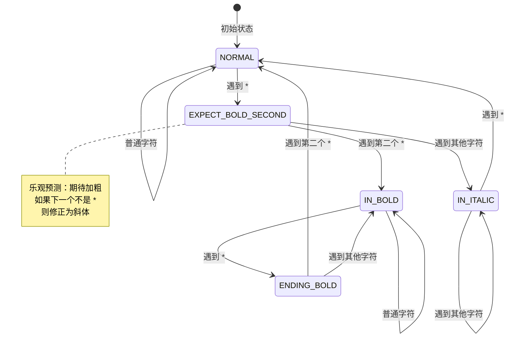
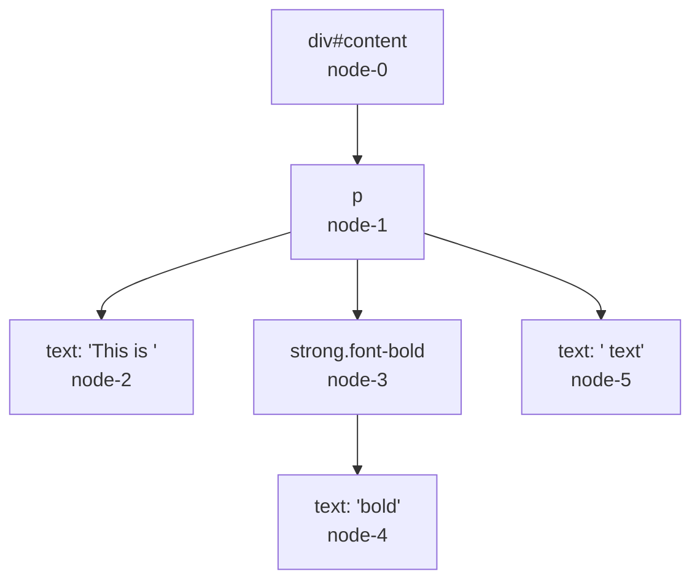
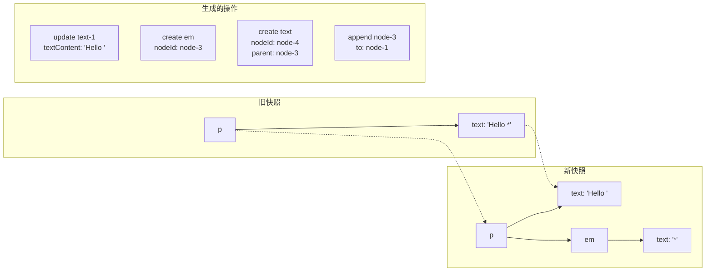
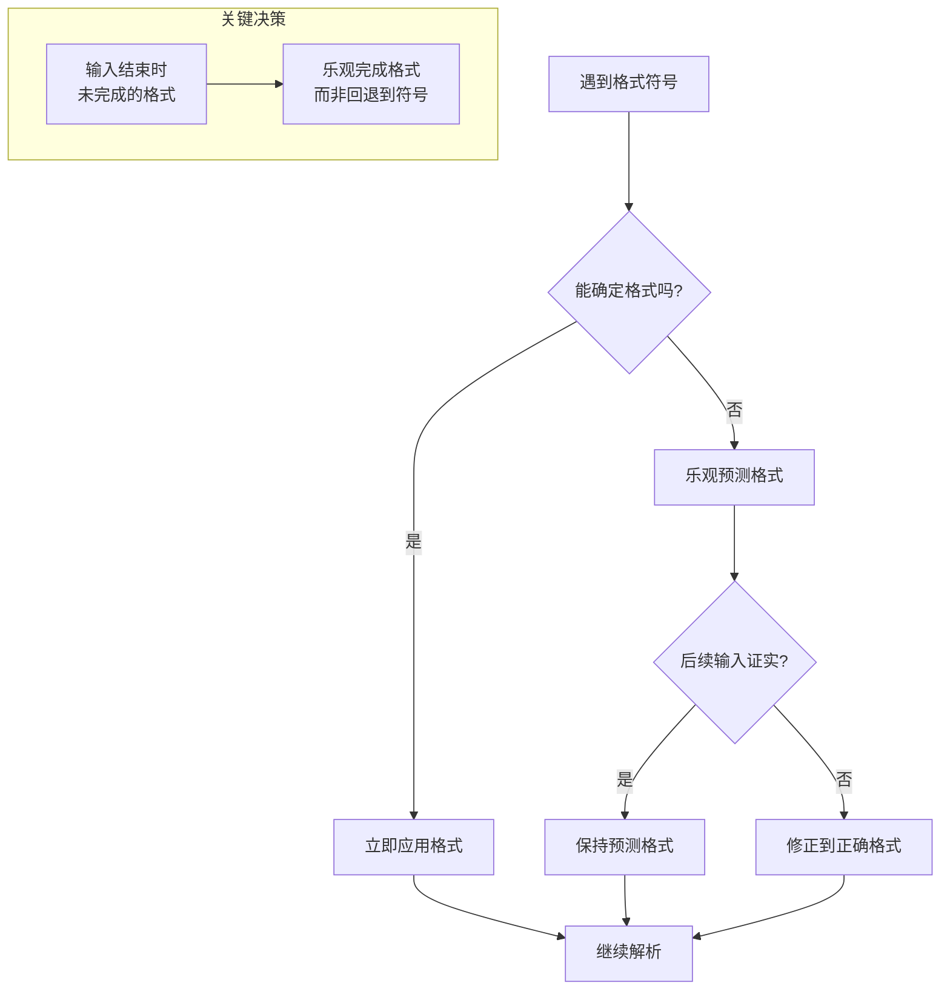
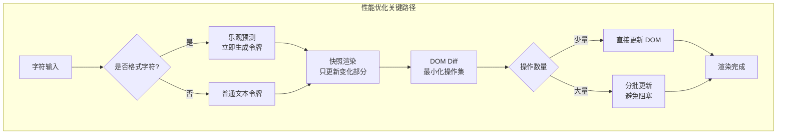
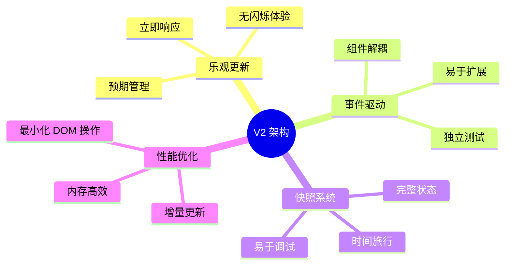

# Markdown River 架构设计文档

## 1. 系统概述

Markdown River 是一个专门解决流式 Markdown 渲染闪烁问题的前端库。它通过**乐观更新**策略和快照驱动的渲染，避免格式符号的视觉闪烁。

### 1.1 设计目标

- **无闪烁渲染**：格式符号不会先显示后消失
- **实时响应**：每个输入立即产生输出
- **乐观更新**：预测用户意图，提前渲染
- **快照驱动**：每个状态都是完整的 DOM 快照
- **事件解耦**：组件间通过事件总线通信

### 1.2 核心理念

**乐观更新，快照驱动**

- 看到 `*` 就预测是斜体，看到 `**` 就预测是加粗
- 每个字符输入都产生一个完整的 DOM 快照
- 通过 DOM Diff 计算最小更新操作
- 预期违背时立即修正，减少视觉跳动

## 2. V2 架构设计

### 2.1 架构概览

系统采用分层的事件驱动架构：



#### 架构说明

**对外接口层**：

- **StreamingRendererV2** 是整个系统的入口，提供 `write()` 方法供外部调用
- 每次调用 `write()` 方法，它会直接调用乐观解析器处理输入字符

**核心组件层**（三个组件平行，通过事件通信）：

1. **乐观解析器**：每次被调用都会生成一个令牌（token），通过 `parser:token` 事件发送
2. **快照渲染器**：内部监听 `parser:token` 事件，每个令牌都会生成完整的 DOM 快照，通过 `snapshot:updated` 事件发送
3. **DOM Diff**：内部监听 `snapshot:updated` 事件，计算与上一个快照的差异，通过 `dom:operations` 事件发送操作指令

**基础设施层**：

- **事件总线**：所有事件的中转站，组件间不直接依赖，全部通过事件解耦
- **样式处理器**：在构造时注入到快照渲染器，提供标签到 CSS 类的映射
- **DOM 管理器**：被 StreamingRendererV2 直接调用，执行实际的 DOM 操作

**关键流程**：

1. 用户调用 `write('*')` → StreamingRendererV2 调用乐观解析器
2. 乐观解析器生成 `ITALIC_START` 令牌 → 发送 `parser:token` 事件
3. 快照渲染器收到事件 → 生成包含 `<em>` 标签的快照 → 发送 `snapshot:updated` 事件
4. DOM Diff 收到事件 → 计算需要创建 `<em>` 元素 → 发送 `dom:operations` 事件
5. StreamingRendererV2 收到事件 → 调用 DOMManagerV2 → 真实 DOM 更新

### 2.2 组件关系

核心组件层的三个模块（乐观解析器、快照渲染器、DOM Diff）处于同一层级，通过事件总线解耦通信：



### 2.3 数据流详解

#### 2.3.1 事件流动图


#### 2.3.2 阶段详解

1. **字符输入阶段**
   - 用户输入字符通过 `write()` 方法进入系统
   - 乐观解析器逐字符处理，生成令牌

2. **令牌处理阶段**
   - 乐观解析器发出 `parser:token` 事件
   - 快照渲染器接收令牌，更新内部 DOM 树表示

3. **快照生成阶段**
   - 快照渲染器生成完整的 DOM 快照
   - 发出 `snapshot:updated` 事件，包含新快照和版本号

4. **差异计算阶段**
   - DOM Diff 接收快照事件
   - 比较新旧快照，生成操作指令

5. **DOM 更新阶段**
   - StreamingRendererV2 接收操作事件
   - 调用 DOMManagerV2 执行操作
   - 直接操作真实 DOM，无批处理

## 3. 核心组件设计

### 3.1 乐观解析器（OptimisticParser）

**职责**：实现真正的乐观更新，立即做出格式预测

**核心特性**：

- **无 POTENTIAL 状态**：看到格式符号立即预测
- **预期管理**：看到第一个 `*` 时进入 `EXPECT_BOLD_SECOND` 状态，期待下一个字符也是 `*` 来确认加粗格式
- **违背处理**：如果下一个字符不是 `*`，立即修正为斜体格式（用户会看到格式变化，但避免了符号闪烁）

**状态机图**：



#### 设计原则：字符-令牌对应

**核心原则**：每个输入字符都必须产生对应的令牌输出，不能"吞掉"字符。

这个原则确保了：

1. 输入输出的一致性
2. 用户感知的连续性
3. 调试的可预测性

#### 预期管理示例

**场景1：用户输入加粗文本 `**bold**`**

```
输入: *        状态: NORMAL → EXPECT_BOLD_SECOND    输出: ITALIC_START (乐观预测)
输入: *        状态: EXPECT_BOLD_SECOND → IN_BOLD   输出: CORRECTION_TO_BOLD_START (一对一修正)
输入: b        状态: IN_BOLD                       输出: TEXT('b')
输入: o        状态: IN_BOLD                       输出: TEXT('o')
输入: l        状态: IN_BOLD                       输出: TEXT('l')
输入: d        状态: IN_BOLD                       输出: TEXT('d')
输入: *        状态: IN_BOLD → ENDING_BOLD          输出: BOLD_END (index: 1)
输入: *        状态: ENDING_BOLD → NORMAL           输出: BOLD_END (index: 2)
```

**场景2：用户输入斜体文本 `*italic*`（后跟空格）**

```
输入: *        状态: NORMAL → EXPECT_BOLD_SECOND    输出: ITALIC_START (乐观预测)
输入: i        状态: EXPECT_BOLD_SECOND → IN_ITALIC 输出: TEXT('i') (确认预测)
输入: t        状态: IN_ITALIC                     输出: TEXT('t')
输入: a        状态: IN_ITALIC                     输出: TEXT('a')
输入: l        状态: IN_ITALIC                     输出: TEXT('l')
输入: i        状态: IN_ITALIC                     输出: TEXT('i')
输入: c        状态: IN_ITALIC                     输出: TEXT('c')
输入: *        状态: IN_ITALIC → ENDING_ITALIC     输出: 无 (等待确认)
输入: (空格)   状态: ENDING_ITALIC → NORMAL        输出: ITALIC_END + TEXT(' ')
```

**设计原理**：斜体结束需要等待确认字符，这是为了支持嵌套语法，如：

- `*italic with **bold** inside*` - 斜体中嵌套加粗
- `**bold with *italic* inside**` - 加粗中嵌套斜体

如果第二个 `*` 立即结束斜体，就无法正确解析这些嵌套情况。

**场景3：预期违背 `* hello`**

```
输入: *        状态: NORMAL → EXPECT_BOLD_SECOND    输出: ITALIC_START (乐观预测)
输入: (空格)   状态: EXPECT_BOLD_SECOND → NORMAL     输出: CORRECTION_TO_TEXT_SPACE (一对一修正)
输入: h        状态: NORMAL                        输出: TEXT('h')
```

**关键洞察**：

- **字符-令牌一对一原则**：每个字符输入产生唯一的令牌输出
- **乐观预测**：第一个 `*` 立即输出 `ITALIC_START`
- **修正令牌**：使用复合令牌（如 `CORRECTION_TO_BOLD_START`）实现一对一修正
- **索引化令牌**：多字符序列（如 `**`）通过索引区分，确保一对一原则
- **零延迟**：用户立即看到格式效果，不需要等待确认
- **信息无丢失**：所有语义信息都被保留在令牌中
- **乐观完成**：在不确定的情况下保持格式，而不是回退到普通文本

#### 修正令牌设计

为了保证字符-令牌一对一原则，设计了以下修正令牌：

- `CORRECTION_TO_BOLD_START`：撤销 `ITALIC_START`，改为 `BOLD_START`
- `CORRECTION_TO_TEXT_SPACE`：撤销 `ITALIC_START`，改为 `*` + `空格`
- `CORRECTION_TO_LINE_BREAK`：撤销 `ITALIC_START`，改为 `*` + `换行`

#### 索引化令牌设计

为了处理多字符序列（如 `**`），设计了索引化令牌：

- `{ type: 'BOLD_END', index: 1 }`：第一个结束标记 `*`
- `{ type: 'BOLD_END', index: 2 }`：第二个结束标记 `*`

渲染器根据索引决定实际处理逻辑：

- `index: 1` 时：准备结束，但不执行操作
- `index: 2` 时：真正结束加粗格式

每个令牌都包含完整的语义信息，渲染器可以据此做出正确的处理动作。

### 3.2 快照渲染器（SnapshotRenderer）

**职责**：将令牌流转换为 DOM 快照

**核心特性**：

- **完整快照**：每次都生成完整的 DOM 树结构
- **样式集成**：与 StyleProcessorV2 集成，包含样式信息
- **版本管理**：每个快照都有唯一版本号

**快照结构示例**：



**快照数据结构**：

```typescript
interface DOMSnapshot {
  nodeId: string;
  type: 'element' | 'text';
  tagName?: string;
  textContent?: string;
  className?: string;
  children?: DOMSnapshot[];
}
```

### 3.3 DOM Diff

**职责**：计算快照差异，生成最小操作集

**核心特性**：

- **高效算法**：只计算必要的 DOM 更新
- **操作类型**：create、update、delete、move
- **树形对比**：递归比较节点树

**差异计算示例**：



**操作数据结构**：

```typescript
type DOMOperation =
  | { type: 'create'; node: DOMSnapshot; parentId?: string }
  | { type: 'update'; nodeId: string; changes: Partial<DOMSnapshot> }
  | { type: 'delete'; nodeId: string }
  | { type: 'move'; nodeId: string; newParentId: string; index?: number };
```

## 4. 基础设施模块

### 4.1 事件总线（EventBus）

**职责**：提供组件间的解耦通信机制

**特性**：

- 支持优先级
- 支持过滤器
- 异步事件处理
- 错误隔离

### 4.2 样式处理器 V2（StyleProcessorV2）

**职责**：管理标签到 CSS 类的映射

**特性**：

- 主题系统
- 样式继承
- 缓存优化
- 无事件依赖（简化设计）

### 4.3 DOM 管理器 V2（DOMManagerV2）

**职责**：执行实际的 DOM 操作

**特性**：

- 直接 DOM 操作
- 节点 ID 映射
- 无批处理（简化设计）
- 无事件系统（被动执行）

## 5. 关键设计决策

### 5.1 为什么选择快照驱动？

- **完整性**：每个时刻的 DOM 状态都是完整的
- **可预测**：状态转换清晰可控
- **易调试**：可以记录和回放快照历史

### 5.2 为什么使用事件解耦？

- **灵活性**：组件可以独立开发和测试
- **扩展性**：易于添加新的处理器
- **可维护**：降低组件间的耦合度

### 5.3 为什么是乐观更新？

- **用户体验**：立即响应，无延迟感
- **视觉平滑**：避免格式符号的闪烁问题，用户看到的是格式变化而非符号突然出现消失
- **性能优化**：减少不必要的渲染

### 5.4 乐观更新的设计哲学

**核心理念：宁可保持格式，不要回退到原始符号**



**设计原则**：

1. **预测优于等待**：看到 `*` 立即预测斜体，而不是等待确认
2. **修正优于撤销**：发现预测错误时修正格式，而不是撤销重来
3. **完成优于回退**：输入结束时完成格式，而不是回退到原始符号
4. **连续性优于准确性**：保持用户体验的连续性比100%的解析准确性更重要

**实际表现**：

- 输入 `*italic` 然后结束 → 显示为斜体格式，而不是 "\*italic"
- 输入 `**bold` 然后结束 → 显示为加粗格式，而不是 "\*\*bold"
- 输入 `*italic*` 后跟空格 → 修正为普通文本，但过程中用户感知到的是格式变化

这种设计确保了流式渲染的视觉连续性，避免了格式符号的闪烁，提供了更好的用户体验。

## 6. 性能考虑

### 6.1 优化策略



- **增量更新**：DOM Diff 只更新变化的部分
- **事件批处理**：同步事件在一个循环内处理
- **样式缓存**：StyleProcessorV2 缓存计算结果

### 6.2 内存管理

- **快照回收**：只保留当前和上一个快照
- **事件清理**：自动清理一次性监听器
- **节点映射**：及时清理无用的节点引用

## 7. 扩展性设计

### 7.1 添加新的解析器

只需实现相同的事件接口：

- 监听输入事件
- 发出 `parser:token` 事件

### 7.2 添加新的渲染策略

可以替换或扩展快照渲染器：

- 监听 `parser:token` 事件
- 发出 `snapshot:updated` 事件

### 7.3 自定义样式

通过 StyleProcessorV2 的主题系统：

- 创建新主题
- 覆盖默认样式
- 动态切换主题

## 8. 未来演进方向

### 8.1 性能优化

- 实现虚拟滚动支持大文档
- Web Worker 解析提升性能
- 增量快照减少内存占用

### 8.2 功能扩展

- 支持更多 Markdown 语法
- 插件系统支持自定义扩展
- 服务端渲染支持

### 8.3 开发体验

- 开发者工具支持快照调试
- 性能分析工具
- 可视化测试工具

## 9. 架构优势总结


