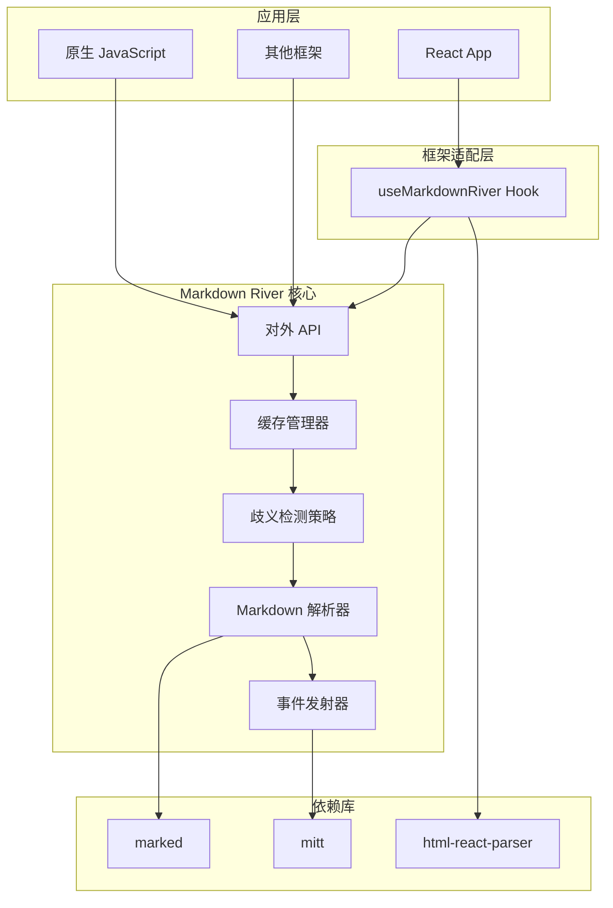
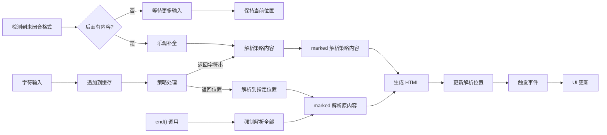
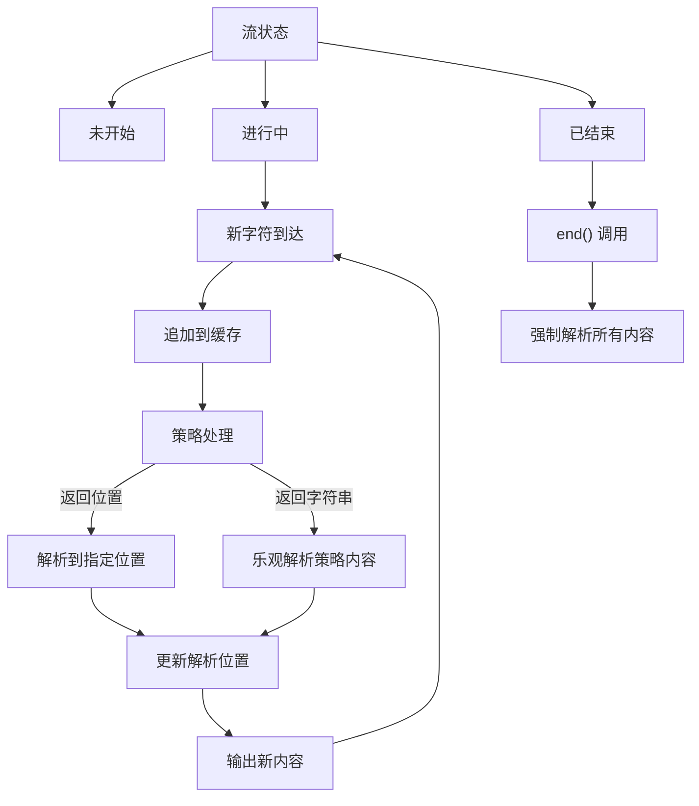
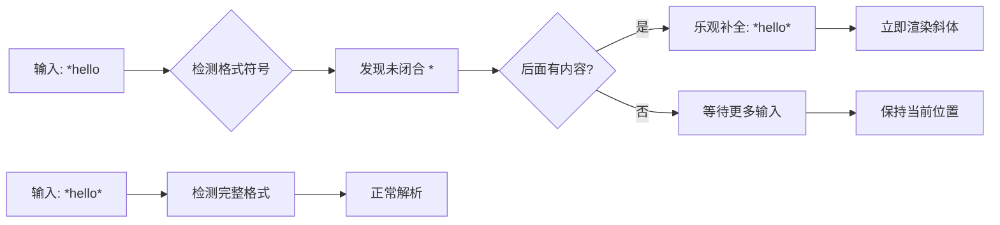
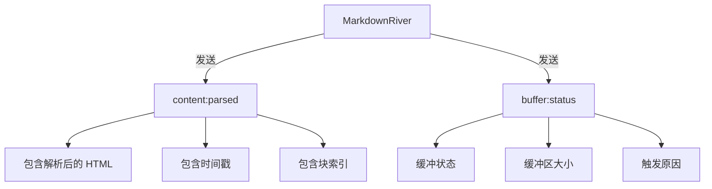
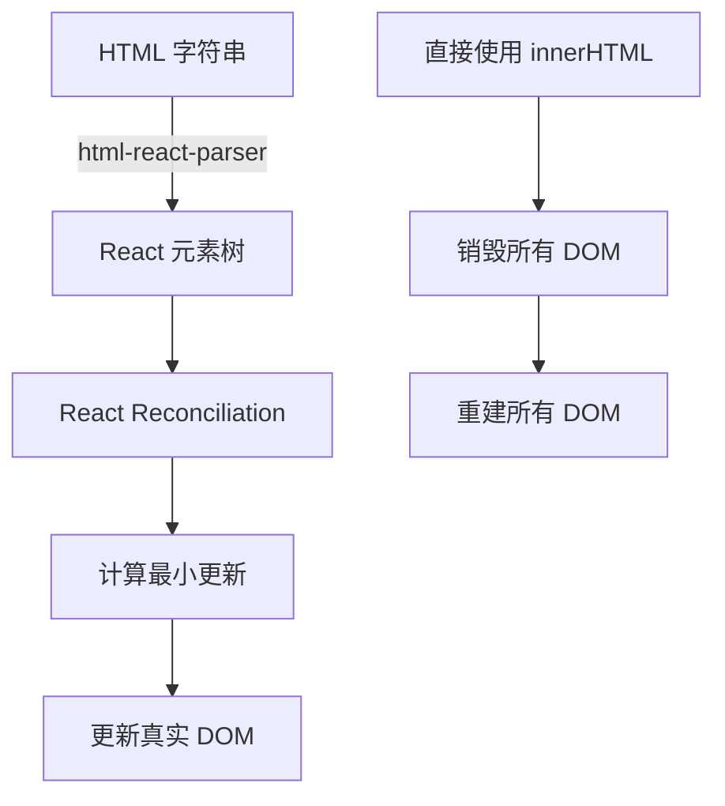
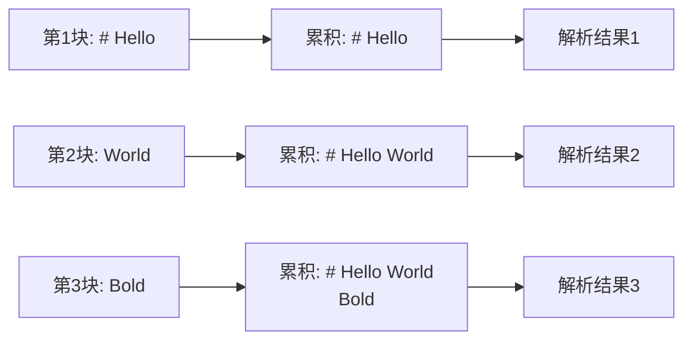
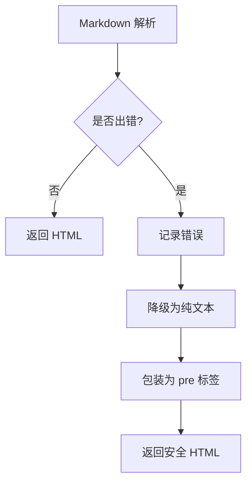
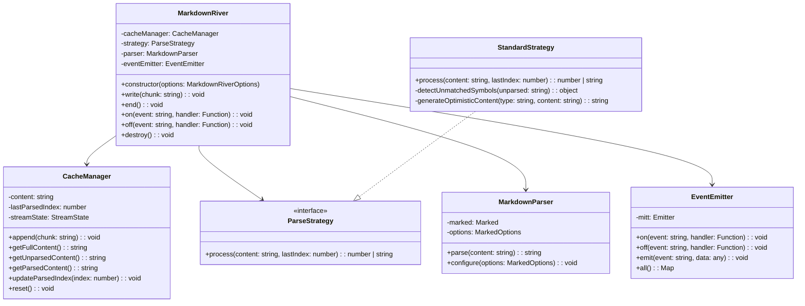
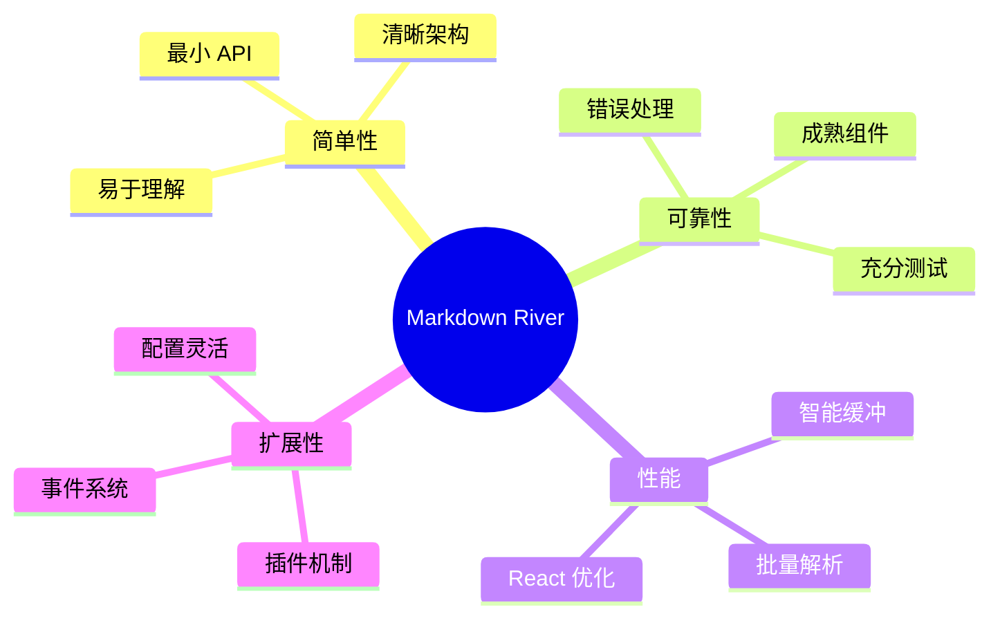

# Markdown River 架构设计文档

## 1. 系统概述

Markdown River 是一个专注于解决流式 Markdown 渲染闪烁问题的轻量级库。通过智能缓冲策略和成熟的开源组件，提供简单可靠的解决方案。

### 1.1 设计理念

**简单可靠，不重复造轮子**

- 使用 **marked** 进行 Markdown 解析
- 使用 **html-react-parser** 优化 React 渲染
- 使用 **mitt** 实现事件系统
- 专注于解决缓冲策略这一核心问题

### 1.2 核心目标

- **消除闪烁**：通过缓冲避免格式符号的显示/隐藏跳变
- **保持流畅**：双阈值策略确保输出的连续性
- **简单集成**：最小化 API，易于集成到任何项目
- **框架无关**：核心库不依赖特定框架

## 2. 架构设计

### 2.1 整体架构



### 2.2 数据流



### 2.3 核心组件说明

#### 2.3.1 React Hook 适配层

**职责**：为 React 应用提供便捷的集成方式

**useMarkdownRiver Hook 特性**：

- 封装了核心 API，提供 React 友好的接口
- 自动管理生命周期（创建和销毁）
- 集成 html-react-parser，输出优化的 React 元素
- 状态管理，自动触发组件重渲染

**提供的接口**：

```typescript
{
  write: (chunk: string) => void;
  end: () => void;
  content: React.ReactNode;  // 解析后的 React 元素
  rawHtml: string;          // 原始 HTML 字符串
}
```

#### 2.3.2 缓存管理器（Cache Manager）

**职责**：管理全量内容缓存和解析位置

**核心功能**：

- 维护完整的输入历史（全量缓存）
- 跟踪已解析位置（lastParsedIndex）
- 提供未解析内容的访问接口
- 管理流状态（未开始/进行中/已结束）

#### 2.3.3 智能渲染策略（Intelligent Rendering Strategy）

**职责**：基于全量上下文决定下一次渲染的内容和解析位置

**接口设计**：

```typescript
interface ParseStrategy {
  /**
   * 处理内容并返回渲染策略
   * @param content 完整内容
   * @param lastParsedIndex 上次解析位置
   * @returns 安全解析位置（number）或处理后的内容（string）
   */
  process(content: string, lastParsedIndex: number): number | string;
}
```

**返回值类型**：

- **number**：返回安全解析位置，使用原内容解析到该位置
- **string**：返回处理后的内容，直接解析该字符串（乐观更新）

**策略特点**：

- 统一的单方法接口，简化调用逻辑
- 支持乐观更新机制，提供即时反馈
- 可以访问全量内容，不限于未解析部分
- 支持内容转换和自动补全功能

#### 2.3.4 Markdown 解析器

**职责**：解析确定无歧义的内容

**特点**：

- 基于 marked 库，功能完整且稳定
- 每次只解析新增的无歧义部分
- 支持 GFM（GitHub Flavored Markdown）
- 可通过配置扩展功能

#### 2.3.5 事件发射器

**职责**：提供轻量级的事件系统

**基于 mitt 实现**：

- 体积小（200 bytes）
- TypeScript 友好
- 支持通配符监听
- 无依赖

## 3. 缓存与解析策略

### 3.1 核心概念定义

| 术语           | 定义                     | 说明                   |
| -------------- | ------------------------ | ---------------------- |
| **缓存区**     | 存储全量上下文的区域     | 保存所有输入的累积内容 |
| **未解析部分** | 新增但尚未解析的内容     | 类似进度条新增的部分   |
| **已解析部分** | 已经处理并输出的内容     | 已经确定格式的部分     |
| **歧义状态**   | 当前内容存在多种解释可能 | 需要更多上下文才能确定 |
| **解析位置**   | 当前已解析内容的结束位置 | 标记解析进度           |

### 3.2 为什么需要缓存？

在流式渲染场景下，逐字符渲染会导致格式符号闪烁：

```
未缓存的渲染过程：
字符流: * i t a l i c *
屏幕显示变化:
1. "*"         (显示星号)
2. "*i"        (显示星号和字母)
3. "*it"       (继续显示)
...
7. "*italic*"  (突然识别为斜体，星号消失)
结果：用户看到星号先出现后消失的闪烁
```

### 3.3 智能缓存机制

**核心理念**：策略驱动的渲染决策，基于全量上下文决定渲染内容和解析位置，支持乐观更新和即时反馈。



### 3.4 渲染决策策略

**策略工作原理**：

- 基于全量上下文进行智能决策
- 检测未闭合的行内格式符号
- 决定返回解析位置或补全内容，实现即时反馈



**支持的策略决策场景**：

- 行内代码：`` `code` `` → 策略决定自动补全并返回字符串
- 斜体/强调：`*text*`、`**text**` → 策略决定补全或返回位置
- 下划线格式：`_text_`、`__text__` → 策略智能决策处理方式
- 链接：`[text]()` → 策略决定补全链接语法
- 列表：`-` 策略决定立即渲染，`- ` 策略决定等待

### 3.5 智能策略接口

```typescript
interface ParseStrategy {
  /**
   * 处理内容并返回渲染策略
   * @param content 完整内容
   * @param lastParsedIndex 上次解析位置
   * @returns 安全解析位置（number）或处理后的内容（string）
   */
  process(content: string, lastParsedIndex: number): number | string;
}
```

**StandardStrategy 决策流程**：

1. **列表特殊处理**：单独 `-` 决定立即渲染，`- ` 决定智能等待
2. **未匹配符号检测**：扫描未解析内容，找到第一个未匹配的格式符号
3. **渲染决策**：
   - 无未匹配符号 → 决定解析到末尾（返回位置）
   - 符号前有完整内容 → 决定优先解析完整部分（返回位置）
   - 符号后有内容 → 决定补全内容（返回字符串）
   - 符号后无内容 → 决定保持位置等待（返回当前位置）
4. **内容生成**：根据决策类型生成补全内容或返回解析位置

### 3.6 工作流程示例

#### 3.6.1 策略补全决策场景

```
初始状态：
缓存: ""
已解析: ""
未解析: ""

输入 "Hello "：
缓存: "Hello "
已解析: "Hello "  （无格式符号，立即解析）
未解析: ""

输入 "*"：
缓存: "Hello *"
已解析: "Hello "  （符号后无内容，等待）
未解析: "*"

输入 "world"：
缓存: "Hello *world"
策略决策: "Hello *world*"  （决定补全并返回字符串）
已解析: "Hello *world*"   （立即显示斜体）
未解析: ""

输入 "*"：
缓存: "Hello *world*"
已解析: "Hello *world*"  （内容未变，保持）
未解析: ""
```

#### 3.6.2 策略优先决策场景

```
输入 "Good *morning* and *"：
缓存: "Good *morning* and *"
策略分析: 前面有完整格式 "*morning*"
策略决策: 17 (决定解析到 "and" 后面，返回位置)
已解析: "Good *morning* and "
未解析: "*"  （等待后续输入）
```

### 3.7 关键参数

- **strategy**: 智能渲染策略 - 决定下一次渲染内容和解析位置
- **streamState**: 流状态 - 未开始/进行中/已结束

**策略驱动特性**：

- 没有缓冲区大小限制（全量缓存）
- 策略完全控制渲染时机和内容
- 智能决策（返回位置 vs 返回补全内容）
- end() 方法会立即强制解析所有内容

### 3.8 配置示例

策略配置示例：

| 场景     | 策略类型   | 特点                 |
| -------- | ---------- | -------------------- |
| AI 对话  | 标准策略   | 平衡各种格式检测     |
| 代码展示 | 自定义策略 | 可优先检测代码块边界 |
| 文档预览 | 自定义策略 | 可调整歧义判断规则   |

### 3.9 end() API 行为

当调用 `end()` 方法时：

- 立即消除歧义阻塞
- 强制解析所有未解析内容
- 将流状态设置为"已结束"
- 输出最终的完整内容

## 4. 事件系统

### 4.1 事件类型



### 4.2 事件流程

1. **content:parsed** - 内容解析完成
   - 触发时机：缓冲区刷新并完成解析
   - 包含数据：HTML 内容、时间戳、块索引

2. **buffer:status** - 缓冲区状态变化
   - 触发时机：开始缓冲或结束缓冲
   - 包含数据：缓冲状态、当前大小、触发原因

## 5. React 集成优化

### 5.1 渲染优化原理



### 5.2 优化效果

使用 html-react-parser 的优势：

- 将 HTML 转换为 React 元素
- 保持元素的引用稳定性
- 利用 React 的 diff 算法
- 只更新真正变化的部分

## 6. 性能考虑

### 6.1 累积解析策略

为确保 Markdown 格式的完整性，解析器采用累积策略：



这确保了跨块的格式（如跨行的代码块）能够正确解析。

### 6.2 内存管理

系统包含多个内存保护机制：

- 最大内容长度限制（默认 1MB）
- 定时器自动清理
- 事件监听器管理
- 销毁时的资源释放

## 7. 扩展性设计

### 7.1 自定义 marked 配置

通过 `markedOptions` 可以扩展解析功能：

- 自定义渲染器
- 代码高亮集成
- 自定义标记扩展
- 安全性配置

### 7.2 事件扩展

基于 mitt 的事件系统支持：

- 自定义事件类型
- 事件拦截和转换
- 批量事件处理
- 异步事件处理

## 8. 错误处理策略

### 8.1 降级机制



### 8.2 边界保护

- 输入验证：检查输入类型和长度
- 解析保护：捕获 marked 异常
- 事件保护：隔离监听器错误
- 资源保护：防止内存泄漏

## 9. 类设计与关系

### 9.1 核心类图



### 9.2 文件结构设计

```
markdown-river/
├── src/
│   ├── index.ts                    # 主入口，导出所有公共 API
│   ├── core/
│   │   ├── MarkdownRiver.ts       # 核心类
│   │   ├── CacheManager.ts        # 缓存管理器
│   │   └── MarkdownParser.ts      # Markdown 解析器封装
│   ├── strategies/
│   │   ├── index.ts               # 策略导出
│   │   ├── ParseStrategy.ts       # 策略接口定义
│   │   └── StandardStrategy.ts    # 标准策略实现
│   ├── events/
│   │   ├── EventEmitter.ts        # 事件发射器封装
│   │   └── types.ts               # 事件类型定义
│   ├── react/
│   │   └── useMarkdownRiver.ts    # React Hook
│   └── types/
│       └── index.ts               # 公共类型定义
├── tests/
│   ├── unit/
│   │   ├── core/
│   │   │   ├── MarkdownRiver.test.ts
│   │   │   ├── CacheManager.test.ts
│   │   │   └── MarkdownParser.test.ts
│   │   └── strategies/
│   │       ├── StandardStrategy.test.ts
│   │       └── ConservativeStrategy.test.ts
│   └── integration/
│       ├── streaming.test.ts       # 流式渲染集成测试
│       └── react-hook.test.ts     # React Hook 集成测试
└── dist/                          # 构建输出
```

### 9.3 模块职责

| 模块             | 职责                      | 依赖              |
| ---------------- | ------------------------- | ----------------- |
| MarkdownRiver    | 协调各模块，提供对外 API  | 所有内部模块      |
| CacheManager     | 管理内容缓存和解析位置    | 无                |
| ParseStrategy    | 定义歧义检测接口          | 无                |
| StandardStrategy | 实现标准歧义检测          | ParseStrategy     |
| MarkdownParser   | 封装 marked，提供解析功能 | marked            |
| EventEmitter     | 封装 mitt，提供事件功能   | mitt              |
| useMarkdownRiver | React 集成                | html-react-parser |

## 10. 最佳实践

### 10.1 参数调优建议

1. **分析使用场景**
   - 输入速度：快速输入需要更大的字符阈值
   - 网络延迟：高延迟需要更长的时间阈值
   - 内容类型：代码需要更大的缓冲区

2. **监控和调整**
   - 使用 buffer:status 事件监控缓冲行为
   - 根据实际触发频率调整参数
   - 平衡实时性和稳定性

3. **性能优化**
   - 避免过小的阈值（频繁渲染）
   - 避免过大的阈值（响应迟钝）
   - 根据设备性能适配

### 9.2 集成建议

1. **错误处理**
   - 始终监听错误事件
   - 提供降级展示方案
   - 记录异常信息

2. **资源管理**
   - 组件卸载时调用 destroy()
   - 及时移除事件监听
   - 避免内存泄漏

3. **用户体验**
   - 提供加载状态提示
   - 平滑的过渡效果
   - 合理的错误提示

## 10. 架构优势总结



通过这种简洁而有效的设计，Markdown River 专注于解决流式渲染的核心问题，为开发者提供一个可靠、易用的解决方案。
