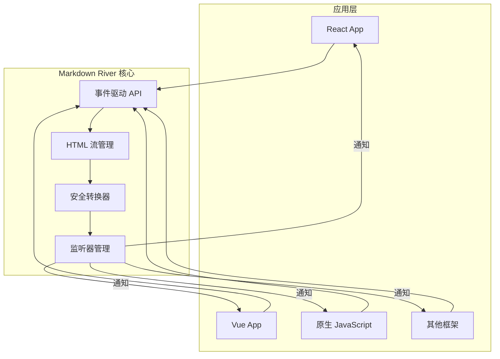
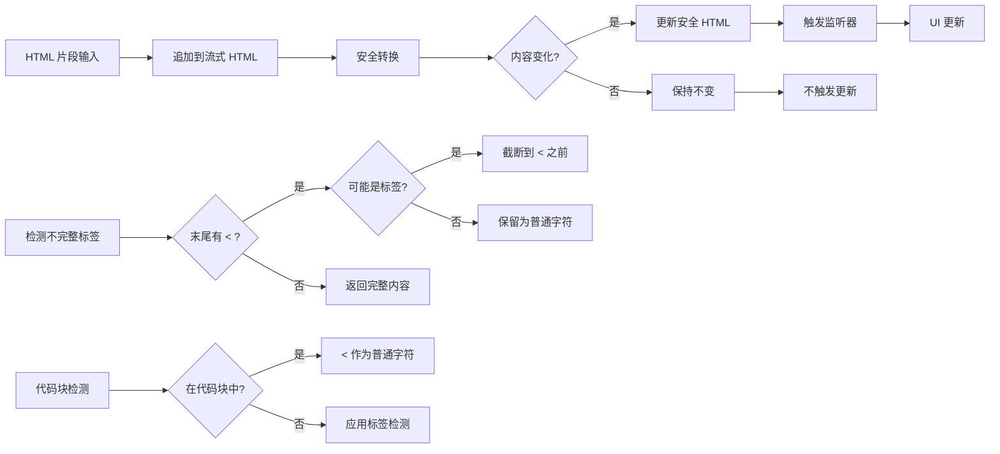
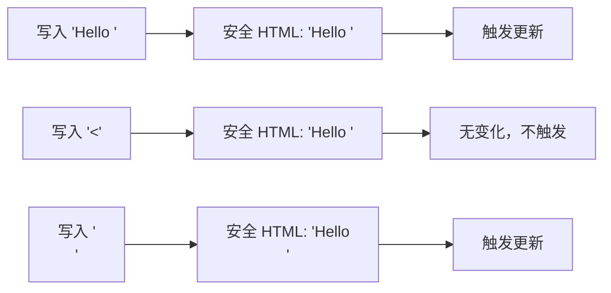

# Markdown River 架构设计文档

## 1. 系统概述

Markdown River 是一个专注于安全的 HTML 流式渲染的轻量级库。通过智能过滤不完整的 HTML 标签，确保只渲染完整的内容，避免闪烁问题。

### 1.1 设计理念

**从 Markdown 到 HTML：正确的场景，正确的技术**

- **不是** Markdown 解析器，而是 HTML 安全渲染器
- **专注** 于解决 AI 流式输出场景的标签完整性问题
- **极简** 的事件驱动 API，易于集成
- **智能** 的变化检测，避免不必要的渲染

### 1.2 核心目标

- **消除闪烁**：通过过滤不完整标签避免内容跳变
- **保持实时**：只缓冲必要的部分，保证流畅体验
- **简单集成**：事件驱动 API，支持任何框架
- **高性能**：只在内容实际变化时触发更新

## 2. 架构设计

### 2.1 整体架构



### 2.2 数据流



### 2.3 核心组件说明

#### 2.3.1 MarkdownRiver 类

**职责**：核心类，管理 HTML 流和监听器

**主要方法**：

- `onHtmlUpdate(listener)` - 注册 HTML 更新监听器
- `offHtmlUpdate(listener)` - 移除监听器
- `write(chunk)` - 写入 HTML 片段
- `reset()` - 重置状态
- `getStreamHtml()` - 获取原始流式 HTML
- `getSafeHtml()` - 获取安全 HTML

**设计特点**：

- 事件驱动架构
- 只在安全 HTML 变化时触发监听器
- 支持多个监听器并发
- 异常隔离机制

#### 2.3.2 安全转换器（convertToSafeHtml）

**职责**：智能过滤不完整的 HTML 标签

**核心逻辑**：

1. 从末尾查找最后一个 `<` 符号
2. 检查是否有对应的闭合 `>`
3. 判断是否在代码块中
4. 识别特殊情况（如比较运算符）
5. 默认过滤不完整标签

**智能识别**：

```javascript
// 比较运算符：保留
"a < 5" → "a < 5"

// 不完整标签：过滤
"<div" → ""
"Hello <str" → "Hello "

// 代码块中：保留
"<pre>if (x < 5)</pre>" → 完整保留
```

#### 2.3.3 监听器管理

**职责**：管理事件监听器的注册和触发

**特性**：

- 支持多个监听器
- 异步错误隔离
- 按注册顺序触发
- 安全的添加/移除机制

## 3. 核心实现细节

### 3.1 为什么选择 HTML 而非 Markdown

从理论层面分析，Markdown 在流式场景下存在根本性问题：

**Markdown 的歧义性**：

- `*` 可能是：普通字符、斜体标记、加粗标记的一部分
- 必须看到配对符号才能确定语义
- 需要回溯和重新渲染

**HTML 的确定性**：

- `<em>` 立即确定是斜体标签
- 无需等待配对，语义即时确定
- 只需处理标签完整性问题

### 3.2 安全转换算法

**核心思想**：智能识别并过滤不完整的 HTML 标签

```
算法流程：
1. 从末尾查找最后一个 < 符号
2. 如果没有 < → 全部内容都安全
3. 如果有对应的 > → 标签完整，内容安全
4. 如果在代码块中：
   a. 如果 < 后面是 / → 可能是 </pre> 的开始，截断
   b. 否则 → < 是普通字符，内容安全
5. 如果 < 后面不是字母或 / → 不可能是标签，内容安全
6. 否则 → 推测为不完整标签，截断到 < 之前
```

### 3.3 特殊情况处理

#### 3.3.1 代码块中的 < 符号

```html
<pre><code>if (x < 5) { ... }</code></pre>
```

**代码块检测机制**：

1. 只有 `<pre><code>` 组合才被视为代码块
2. 单独的 `<pre>` 标签不是代码块（只是预格式化文本）
3. 单独的 `<code>` 标签是行内代码，不是代码块

检测方法：

- 使用正则表达式匹配 `<pre><code>` 模式
- 匹配对应的 `</code></pre>` 结束模式
- 通过比较开始和结束标签的数量和位置判断是否在代码块中

**特殊处理：代码块结束标签的不完整形式**

当流式输出在 `</pre>` 标签中间截断时（如 `</`、`</p`、`</pr`），需要特殊处理：

```javascript
// 如果在代码块中遇到以 / 开头的不完整标签
if (isInCodeBlock && afterBracket.match(/^\//)) {
  // 可能是 </pre> 的开始，应该截断
  return html.substring(0, lastOpenBracket);
}
```

这避免了在代码块结尾显示不完整的闭合标签。

#### 3.3.2 比较运算符识别

```javascript
// 正则：/^[^a-zA-Z/]/
"a < 5"     → < 后面是空格，保留
"x < !"     → < 后面是感叹号，保留
"<div"      → < 后面是字母，过滤
"</"        → < 后面是斜杠，过滤
```

### 3.4 事件驱动的优势

**传统方式**：

```javascript
const html = river.write(chunk); // 返回值模式
setContent(html);
```

**我们的方式**：

```javascript
river.onHtmlUpdate(html => {
  // 事件驱动模式
  setContent(html);
});
river.write(chunk);
```

**优势**：

1. 支持多个监听器
2. 解耦数据流和渲染逻辑
3. 只在内容变化时触发
4. 异常隔离

## 4. API 设计

### 4.1 核心 API

```typescript
class MarkdownRiver {
  // 事件监听
  onHtmlUpdate(listener: (html: string) => void): void;
  offHtmlUpdate(listener: (html: string) => void): void;

  // 数据写入
  write(chunk: string): void;

  // 状态管理
  reset(): void;

  // 获取内容
  getStreamHtml(): string; // 原始流式内容
  getSafeHtml(): string; // 安全渲染内容
}
```

### 4.2 使用示例

**基础用法**：

```javascript
const river = new MarkdownRiver();

// 注册监听器
river.onHtmlUpdate(html => {
  container.innerHTML = html;
});

// 写入流式内容
stream.on('data', chunk => {
  river.write(chunk);
});
```

**React 集成**：

```jsx
function StreamingContent() {
  const [html, setHtml] = useState('');
  const riverRef = useRef(new MarkdownRiver());

  useEffect(() => {
    const river = riverRef.current;
    river.onHtmlUpdate(setHtml);

    return () => {
      river.offHtmlUpdate(setHtml);
    };
  }, []);

  return <div dangerouslySetInnerHTML={{ __html: html }} />;
}
```

## 5. 性能特性

### 5.1 智能更新机制



### 5.2 内存效率

- **最小缓冲**：只缓冲可能不完整的标签部分
- **无冗余存储**：流式 HTML 和安全 HTML 共享大部分内容
- **即时释放**：标签完整后立即释放缓冲

### 5.3 计算效率

- **O(1) 写入**：追加操作，无需遍历
- **O(n) 转换**：n 为末尾不完整部分长度，通常很小
- **局部扫描**：只从最后一个 `<` 开始分析

## 6. 测试体系

### 6.1 E2E 测试架构

```
tests/e2e/
├── runner.test.ts      # 测试运行器
└── io/                 # JSON 驱动的测试用例
    ├── html-basic.json
    ├── html-incomplete.json
    ├── html-code-block.json
    └── ...
```

### 6.2 测试用例设计

每个 JSON 文件包含：

```json
{
  "description": "测试描述",
  "chunks": ["输入", "片段", "序列"],
  "expectedOutputs": ["期望", "的", "输出", "序列"]
}
```

### 6.3 测试覆盖

- **基础功能**：完整标签、文本内容
- **边界情况**：不完整标签、嵌套标签
- **特殊场景**：代码块、比较运算符
- **性能测试**：大文本、频繁更新

## 7. 工程实践

### 7.1 项目结构

```
markdown-river/
├── src/
│   └── core/
│       └── MarkdownRiver.ts    # 核心实现（单文件）
├── tests/
│   └── e2e/                    # 端到端测试
├── examples/
│   └── react-vite/             # React 示例
└── demo/                       # 在线演示
```

### 7.2 依赖管理

**零运行时依赖**：

- 无需第三方库
- 纯 TypeScript 实现
- 打包后体积极小

### 7.3 构建配置

- **TypeScript**：严格类型检查
- **ESLint**：代码规范
- **Vitest**：单元测试
- **Rollup**：打包工具

## 8. 最佳实践

### 8.1 AI 配置建议

```javascript
// OpenAI 示例
const response = await openai.chat.completions.create({
  messages: [
    {
      role: 'system',
      content: '请使用 HTML 标签格式化输出，例如 <strong> 而不是 **',
    },
  ],
  stream: true,
});
```

### 8.2 错误处理

```javascript
river.onHtmlUpdate(html => {
  try {
    updateUI(html);
  } catch (error) {
    console.error('UI update failed:', error);
    // 其他监听器不受影响
  }
});
```

### 8.3 性能优化

- 使用 `requestAnimationFrame` 批量更新 DOM
- 避免在监听器中进行重计算
- 考虑使用虚拟滚动处理长内容

## 9. 架构决策记录

### 9.1 为什么不再支持 Markdown

**背景**：项目最初名为 "Markdown River"，计划支持 Markdown 流式渲染。

**决策**：专注于 HTML 流式渲染，不再支持 Markdown。

**原因**：

1. Markdown 符号歧义性导致的闪烁问题无法根本解决
2. HTML 标签语义明确，只需处理完整性问题
3. AI 可以直接输出 HTML，无需 Markdown 中间层
4. 简化实现，提高可靠性

### 9.2 事件驱动 vs 返回值

**决策**：使用事件驱动 API 而非返回值模式。

**原因**：

1. 支持多个监听器，适合复杂应用场景
2. 解耦数据流和渲染逻辑
3. 便于实现智能更新（只在变化时触发）
4. 更好的错误隔离

### 9.3 单文件实现

**决策**：核心功能集中在单个文件 `MarkdownRiver.ts` 中。

**原因**：

1. 功能足够简单，不需要复杂的模块划分
2. 便于理解和维护
3. 减少构建复杂度
4. 零运行时依赖

## 10. 未来展望

### 10.1 可能的扩展

- **插件系统**：支持自定义标签处理逻辑
- **流控制**：背压处理、暂停/恢复
- **统计信息**：性能指标、渲染统计
- **Web Components**：提供原生 Web 组件

### 10.2 保持简单

核心原则：**保持简单，专注于解决一个问题**。

不会添加的功能：

- Markdown 解析
- 语法高亮
- 自定义渲染器
- 复杂的配置选项

## 11. 总结

Markdown River 通过以下设计实现了其目标：

1. **正确的技术选择**：HTML 而非 Markdown
2. **极简的 API**：6 个方法解决所有问题
3. **智能的实现**：只在必要时缓冲，只在变化时更新
4. **可靠的架构**：事件驱动、错误隔离、零依赖

这个项目证明了：**简单的解决方案往往是最好的解决方案**。
