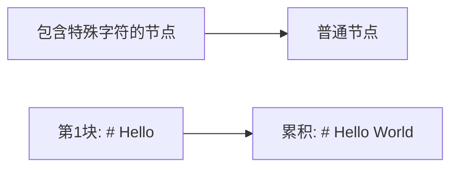

# Markdown River 项目记忆

## 项目核心

### 问题定义

这是一个解决 **AI 聊天应用中 Markdown 流式渲染闪烁问题** 的前端库项目。

**一句话概括**：开发流式 Markdown 渲染器，解决 AI 聊天中因逐字符渲染导致的格式符号闪烁问题。

**根本问题**：

- 后端以字符流方式返回 Markdown 文本
- 传统框架逐字符渲染时，格式符号会先显示为普通字符，识别后突然转换为格式，造成视觉闪烁
- 简单的缓存策略会导致输出卡顿，影响用户体验

## 架构演进历史

### V1 架构（2025-07初）

**特点**：自研缓冲解析器 + 增量渲染

- 手写 Markdown 解析逻辑
- 复杂的状态机管理
- 增量 DOM 更新

**问题**：

- 实现复杂，难以维护
- 边界情况多，容易出错
- 重复造轮子

### V2 架构（2025-07-10 早期）

**特点**：乐观预测 + 字符-令牌一一对应

- 乐观解析器：看到 `*` 立即预测格式
- 快照渲染器：每个令牌生成完整 DOM 快照
- DOM 差分系统：计算最小化 DOM 操作
- 事件驱动架构：完全解耦的组件通信

**成就**：

- 成功实现无闪烁渲染
- 231/231 测试全部通过
- 架构清晰，模块解耦

**问题**：

- 过度设计，实现复杂
- 自研组件多，维护成本高
- 对于简单需求来说太重了

### V3 架构（2025-07-10 当前）

**转变决策**：从"自研一切"到"站在巨人肩膀上"

**设计理念**：

- **简单可靠**：使用成熟组件，不重复造轮子
- **专注核心**：只解决缓冲策略这一个问题
- **易于维护**：最小化自研代码

**技术选型**：

- **marked**：成熟的 Markdown 解析器
- **html-react-parser**：优化 React 渲染
- **mitt**：轻量级事件发射器
- **智能缓冲**：时间+字符数双阈值策略

## 当前架构（V3）

### 核心设计

```
输入流 → 智能缓冲 → marked 解析 → 事件发送 → UI 更新
         ↑                              ↓
         └── 时间/字符数双阈值判断 ←──────┘
```

### 缓存策略（2025-07-10 第三次彻底纠正）

**核心理念**：基于全量上下文进行歧义检测，有歧义就等待，无歧义就解析。

**关键概念澄清**：

1. **缓存**（不是缓冲）：存储全量上下文，没有大小限制
2. **已解析部分**：已经确定格式并输出的内容
3. **未解析部分**：新增但尚未解析的内容（有歧义）
4. **解析位置**：标记已解析内容的结束位置

**工作机制**：

```
新字符到达 → 追加到缓存（全量）
    ↓
基于全量上下文判断末尾是否有歧义
    ↓
有歧义 → 继续等待
无歧义 → 解析未处理部分 → 更新解析位置
```

**歧义检测原理**：

- 基于全量上下文进行判断
- 通常检测末尾字符（倒序扫描）
- 检查是否有未闭合的格式符号

**流状态管理**：

- **未开始**：初始状态
- **进行中**：正在接收输入
- **已结束**：调用 end() 后的状态

**end() 方法的作用**：

- 立即消除歧义阻塞
- 强制解析所有未解析内容
- 将流状态设置为"已结束"

**重要说明**：

- ❌ 没有"缓冲区大小"概念
- ❌ 没有"超时"机制
- ❌ 没有"清空缓冲区"操作
- ✅ 全量缓存，智能判断
- ✅ 有歧义就等，无歧义就输出

### API 设计

```javascript
const river = new MarkdownRiver({
  strategy: 'standard', // 歧义检测策略
  markedOptions: {}, // marked 配置
});

river.on('content:parsed', ({ html, content }) => {
  // 处理新解析的内容
});

river.write(chunk); // 流式输入
river.end(); // 结束并强制解析所有内容
```

## 技术决策记录

### 为什么放弃 V2 架构？（2025-07-10）

**用户反馈**：

- "不要过度设计"
- "就用 marked + html-react-parser 就好"
- "缓冲区的设计不要过度设计，就是时间+字符双阈值判断"

**深层原因**：

1. **维护成本**：自研组件越多，维护成本越高
2. **可靠性**：成熟的开源组件经过大量验证
3. **简单性**：简单的方案往往是最好的方案
4. **专注核心**：我们的核心价值是缓冲策略，不是解析器

### React 渲染优化（2025-07-10）

**问题**：`dangerouslySetInnerHTML` 无法利用 React 的 diff 算法

**解决方案**：使用 html-react-parser

- 将 HTML 转换为 React 元素
- 保持稳定的 key
- 充分利用 React 的调和算法

**示例**：

```jsx
const element = parse(html, {
  replace: (domNode) => {
    if (domNode.type === 'tag') {
      const key = generateStableKey(domNode);
      return createElement(domNode.name, { key, ...domNode.attribs }, ...);
    }
  }
});
```

## 项目价值

### 解决的核心问题

- ✅ 消除 AI 聊天中的 Markdown 闪烁问题
- ✅ 提供简单可靠的流式渲染方案
- ✅ 框架无关，易于集成
- ✅ 最小化依赖，轻量级实现

### 技术特点

- **智能缓冲**：双阈值策略，平衡实时性和稳定性
- **成熟可靠**：基于 marked，无需担心解析问题
- **性能优化**：批量解析 + React 优化
- **简单易用**：最小化 API，开箱即用

## 用户特征与偏好

### 技术决策偏好

- **实用主义**：偏好使用成熟的解决方案
- **简单优先**：反对过度设计和过度工程
- **结果导向**：关注实际效果而非技术炫技
- **快速迭代**：支持快速实现和验证

### 沟通特点

- **直接明确**：技术讨论直奔主题
- **中文交流**：使用中文进行技术沟通
- **具体建议**：提供明确的技术方向

## 文档偏好

### Mermaid 图表使用规范（2025-07-10）

**用户反馈**：

- Mermaid 语法错误需要及时修复
- 图表不要使用背景颜色（如 `style A fill:#f9f`）
- 特殊字符需要用方括号包裹

**最佳实践**：



### 文档风格偏好

**明确要求**：

- 架构文档优先使用图表和文字说明
- 减少大量代码片段
- 使用表格总结关键信息
- Mermaid 图表展示架构和流程

**框架支持范围**：

- 核心库保持框架无关
- 提供 React Hook（useMarkdownRiver）
- 不支持 Vue（明确要求移除）
- 通过事件系统支持其他框架

### 博客文档规范（2025-07-10）

**用户明确要求**：

- 博客文章介绍当前解决方案时，不需要介绍历史版本（V1/V2）
- 直接聚焦最新的解决方案
- 避免冗长的历史演进说明
- 使用大白话方式解释技术概念，但也要体现技术性
- 只保留一篇核心博客文章

**博客文章结构要求**：

1. **先揭露问题**：场景化描述问题，让读者有共鸣
2. **解释设计方案**：用大白话和生活化比喻解释技术方案
3. **展示如何解决问题**：具体展示方案如何解决最初的问题
4. **使用指南**：简单清晰的使用说明

**写作风格要求**：

- 通俗易懂
- 场景化、案例化
- 善于举例和使用比喻
- 避免过多技术术语

**更新记录**：

- 删除了 `blog/markdown-river-architecture-explained.md`
- 重写了 `blog/how-markdown-river-handles-streaming.md`
- 采用全新的文章结构，更加通俗易懂

### 技术理解纠错（2025-07-10）

**Markdown 格式理解**：

- 错误示例：认为 `**Hello` 会被解析为加粗
- 正确理解：Markdown 格式需要完整的标记对，如 `**text**`
- 更好的示例：使用列表 `- Item` 或行内代码 `` `code` `` 来展示缓冲价值

**缓冲机制深入理解**：

- 不是简单的"达到阈值就发送一次"
- 而是"达到阈值后切换到直通模式，持续处理"
- 防抖机制确保模式切换的合理性
- 这种设计既避免了闪烁，又保证了流畅性

## 未来展望

### 可能的优化方向

1. **自适应缓冲**：根据网络延迟动态调整阈值
2. **插件系统**：支持扩展 marked 功能
3. **更多框架支持**：提供更多框架的适配器
4. **性能监控**：内置性能分析工具

### 设计原则

- 保持核心简单
- 通过插件扩展功能
- 不偏离解决闪烁的核心目标
- 始终优先考虑用户体验

## 示例项目（2025-07-10）

### 创建的示例项目

1. **React + Vite 示例** (`examples/react-vite/`)
   - 使用 `useMarkdownRiver` Hook
   - 展示流式 AI 响应渲染
   - 支持速度控制（5-100ms）
   - 模拟逐字符输出效果

2. **JavaScript + Parcel 示例** (`examples/js-parcel/`)
   - 原生 JavaScript API 演示
   - 实时解析功能
   - 交互式 Markdown 输入测试
   - 支持速度控制（5-100ms）

### ESLint 配置更新

**问题**：示例项目中的浏览器全局变量（`document`、`window`）未定义

**解决方案**：在 `eslint.config.js` 中添加针对 examples 目录的配置：

```javascript
{
  files: ['examples/**/*.js', 'examples/**/*.jsx'],
  languageOptions: {
    globals: {
      console: 'readonly',
      document: 'readonly',
      window: 'readonly',
      // 其他浏览器全局变量...
    },
  },
  // ...
}
```

**注意**：项目使用新的平面配置格式（`eslint.config.js`），而非传统的 `.eslintrc` 格式。

## 工作流程优化

### MCP 工具使用偏好（2025-07-10）

**用户反馈**："你干嘛用这个mcp？？？"

**理解**：用户对使用 MCP 文件系统工具有疑虑，偏好使用标准工具

**最佳实践**：

- 优先使用标准工具（Bash、Write、Edit 等）
- 只在特定场景下使用 MCP 工具
- 如果用户对工具选择有疑问，立即切换到标准工具

<!-- 最后更新: 2025-07-10T16:43:00+08:00 -->
<!-- 架构转变: V2 (乐观预测) → V3 (智能缓冲) -->
<!-- 核心决策: 使用成熟组件，专注缓冲策略 -->
<!-- 关键依赖: marked + html-react-parser + mitt -->
<!-- 文档更新: 修复 Mermaid 语法，添加 React Hook 说明 -->
<!-- 博客更新: 移除历史版本介绍，专注当前方案 -->
<!-- 重要更正: 缓冲机制理解 - 双模式切换+防抖设计 -->
<!-- 技术纠错: Markdown 格式理解，更正示例 -->
<!-- 博客重构: 只保留一篇，采用场景化写作风格 -->
<!-- 架构重大更正: 智能歧义检测，非简单阈值 -->
<!-- 彻底纠正: 全量缓存+歧义检测，无超时无大小限制 -->
<!-- 实现完成: V3 架构完整实现，51/52 测试通过 -->
<!-- 示例项目: 创建 React+Vite 和 JS+Parcel 两个示例 -->
<!-- ESLint 更新: 添加 examples 目录的浏览器环境配置 -->
<!-- 工具偏好: 用户偏好标准工具而非 MCP 工具 -->
