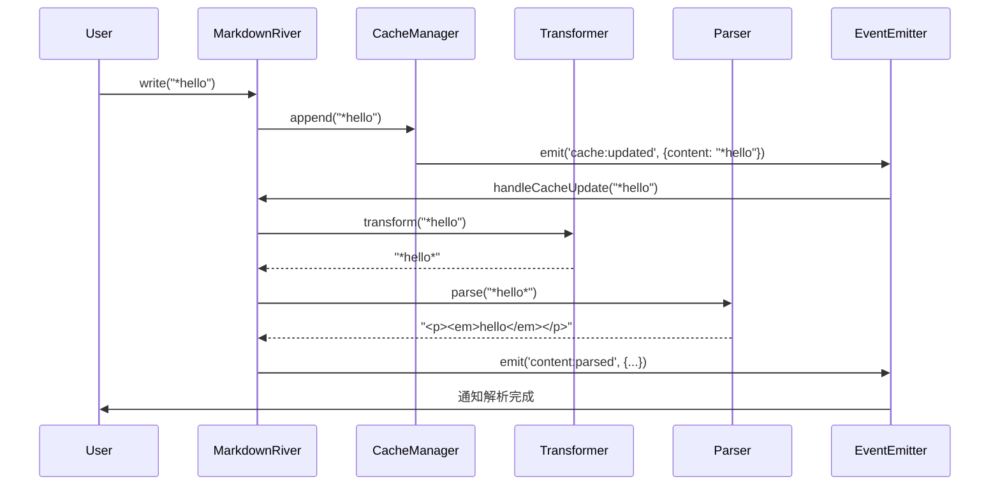

# 事件驱动架构

## 概述

在 2025-07-10 的第二次重构中，我们将 CacheManager 简化为纯粹的缓存组件，通过事件系统实现模块间的解耦。

## 架构设计

### 旧架构（状态管理）

```
CacheManager 维护：
- content（内容）
- lastParsedIndex（解析位置）
- streamState（流状态）

MarkdownRiver 直接调用 CacheManager 的方法
```

### 新架构（事件驱动）

```
CacheManager 只维护：
- content（内容）

事件流：
write() → CacheManager.append() → 发送 cache:updated 事件
                                       ↓
                         MarkdownRiver 监听并处理
                                       ↓
                              转换 → 解析 → 发送 content:parsed
```

## 核心变化

### 1. CacheManager 简化

```typescript
export class CacheManager {
  private content: string = '';
  private eventEmitter: EventEmitter;

  constructor(eventEmitter: EventEmitter) {
    this.eventEmitter = eventEmitter;
  }

  append(chunk: string): void {
    this.content += chunk;
    // 自动发送事件
    this.eventEmitter.emit('cache:updated', { content: this.content });
  }

  getContent(): string {
    return this.content;
  }

  reset(): void {
    this.content = '';
  }
}
```

### 2. MarkdownRiver 事件监听

```typescript
constructor(options: MarkdownRiverOptions = {}) {
  this.eventEmitter = new EventEmitter();
  this.cacheManager = new CacheManager(this.eventEmitter);

  // 监听缓存更新事件
  this.eventEmitter.on('cache:updated', ({ content }) => {
    this.handleCacheUpdate(content);
  });
}

private handleCacheUpdate(content: string): void {
  // 转换 → 解析 → 发送事件
  const transformedContent = this.transformer.transform(content);
  const html = this.parser.parse(transformedContent);

  this.eventEmitter.emit('content:parsed', {
    html,
    content: transformedContent,
    timestamp: Date.now(),
  });
}
```

### 3. 状态管理转移

- 流状态（idle/streaming/ended）现在由 MarkdownRiver 直接管理
- 解析位置不再需要，因为每次都是全量处理
- CacheManager 变成了一个纯粹的内容容器

## 优势

1. **解耦性更好**：模块间通过事件通信，降低耦合度
2. **职责单一**：每个模块只负责自己的核心功能
3. **易于扩展**：可以轻松添加新的事件监听器
4. **更简单**：减少了状态管理的复杂性

## 事件流程图



## 迁移注意事项

这次重构对外部 API 没有影响，所有的改变都是内部实现。用户代码无需修改。
